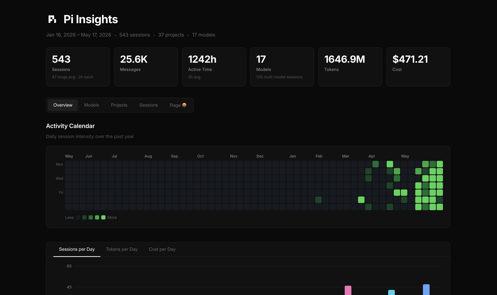

# pi-insights

Beautiful analytics reports for your [pi coding agent](https://pi.dev) sessions.

`pi-insights` is a Pi extension that adds an `/insights` command. It scans your local Pi session history and generates a self-contained HTML dashboard with usage, model, project, session, trend, recommendation, and “rage” analytics.

## Features

- **Overview** — Activity calendar, sessions/tokens/cost per day, activity by hour, and top tools
- **Trends** — Week-over-week deltas, decay-weighted activity, trajectory, anomalies, and deterministic friction signals
- **Models** — Token distribution, per-model breakdown, thinking levels, and stop reasons
- **Model Efficiency** — Cost/token, cost/message, session duration, and tool-error signals by model
- **Projects** — Per-project sessions, messages, tokens, and cost with sortable bars
- **Sessions** — Searchable/filterable session table by project name or date
- **Recommendations** — Deterministic takeaways plus optional AI-derived goals, outcomes, friction, next steps, and “stop doing” suggestions
- **Rage 🤬** — Profanity analytics: swear rate, filthiest model, peak hour, top words, and project breakdown
- **Portable reports** — Single self-contained HTML file and optional Markdown export; no server required, works from `file://`

## Preview

<video controls width="100%" src="https://raw.githubusercontent.com/ygncode/pi-insights/main/assets/demo.mp4"></video>

If the embedded video does not render in your client, [watch the demo video](https://raw.githubusercontent.com/ygncode/pi-insights/main/assets/demo.mp4).



More screenshots:

- [Models](assets/pi-insights-02-models.png)
- [Projects](assets/pi-insights-03-projects.png)
- [Sessions](assets/pi-insights-04-sessions.png)
- [Rage analytics](assets/pi-insights-05-rage.png)

## Install

### From npm

```bash
pi install npm:@ygncode/pi-insights
```

### From GitHub

```bash
pi install git:github.com/ygncode/pi-insights
```

### Try without installing

```bash
pi -e npm:@ygncode/pi-insights
# or
pi -e git:github.com/ygncode/pi-insights
```

## Usage

Inside Pi, run:

```text
/insights
```

The report opens automatically and is written to:

```text
~/.pi/agent/insights-reports/pi-insights.html
```

Each run overwrites the same report file.

### Flags

```text
/insights --no-open          # generate HTML without opening the browser
/insights --since 30d        # include sessions from the last 30 days
/insights --refresh          # clear pi-insights caches before regenerating
/insights -r                 # alias for --refresh
/insights --md               # also write ~/.pi/agent/insights-reports/pi-insights.md
```

Flags can be combined, for example:

```text
/insights --no-open --since 30d --refresh --md
```

## What gets analyzed?

`pi-insights` reads local Pi session JSONL files from:

```text
~/.pi/agent/sessions/
```

The deterministic parser and analytics run locally. Optional AI facets use the active Pi model, when available, to summarize bounded recent session excerpts into derived fields such as goals, outcomes, friction, recommendations, and stop-doing suggestions.

Privacy notes:

- Raw session transcripts are not stored in the generated report JSON.
- Cache files store parsed metadata and derived AI facets, not raw transcript text.
- If no model credentials/API are available, the report still succeeds with deterministic analysis and recommendations.

## Cache and outputs

Generated reports:

```text
~/.pi/agent/insights-reports/pi-insights.html
~/.pi/agent/insights-reports/pi-insights.md   # only with --md
```

Derived caches:

```text
~/.pi/agent/usage-data/pi-insights/session-meta/
~/.pi/agent/usage-data/pi-insights/facets/
```

Use `/insights --refresh` to bypass and recreate these caches.

## Package metadata

This repo is a Pi package. `package.json` declares:

```json
{
  "keywords": ["pi-package"],
  "pi": {
    "extensions": ["./index.ts"]
  }
}
```

That allows users to install it with `pi install` from npm, GitHub, or a local path.

## pi.dev package gallery

This package is prepared for the [Pi package gallery](https://pi.dev/packages):

- npm package name: `@ygncode/pi-insights`
- GitHub repo: `https://github.com/ygncode/pi-insights`
- Pi package keyword: `pi-package`
- Pi extension manifest: `pi.extensions = ["./index.ts"]`
- Gallery image: `assets/pi-insights-01-overview.png`
- Gallery video: `assets/demo.mp4`

After publishing to npm, submit or list the package on <https://pi.dev/packages> using the npm package URL/name.

## Development

```bash
npm install
npm run build        # build the React frontend into dist/
npm test             # run all tests
npm run test:watch   # watch mode
npm run test:coverage
```

`dist/` is intentionally included in the package so Pi can run the extension immediately after npm/git installation without requiring users to build the frontend.

## Architecture

```text
index.ts          — Extension entry point; registers the /insights command
lib/
  cache.ts        — Versioned derived-data cache helpers
  cli.ts          — /insights argument parsing and completions
  facets.ts       — Optional AI facet extraction and recommendation shaping
  markdown.ts     — Markdown report rendering
  parser.ts       — Parses JSONL session files into ParsedSession objects
  analytics.ts    — Computes aggregate stats from parsed sessions
  rage.ts         — Profanity detection
  types.ts        — Shared TypeScript interfaces
src/
  App.tsx         — React frontend
  utils.ts        — Formatting helpers
  components/
    ContributionCalendar.tsx
tests/
  lib/            — Unit tests for parser, analytics, cache, CLI, facets, Markdown, and rage
  src/            — Unit tests for frontend utils
```

## Tech stack

- React 19 + TypeScript 6 + Vite 8
- Recharts 3
- Vitest 4

## License

MIT
